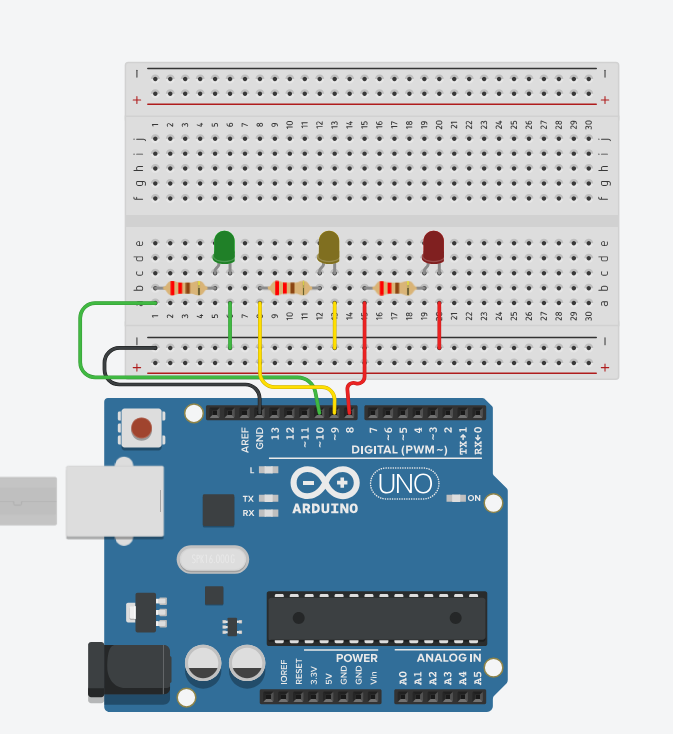
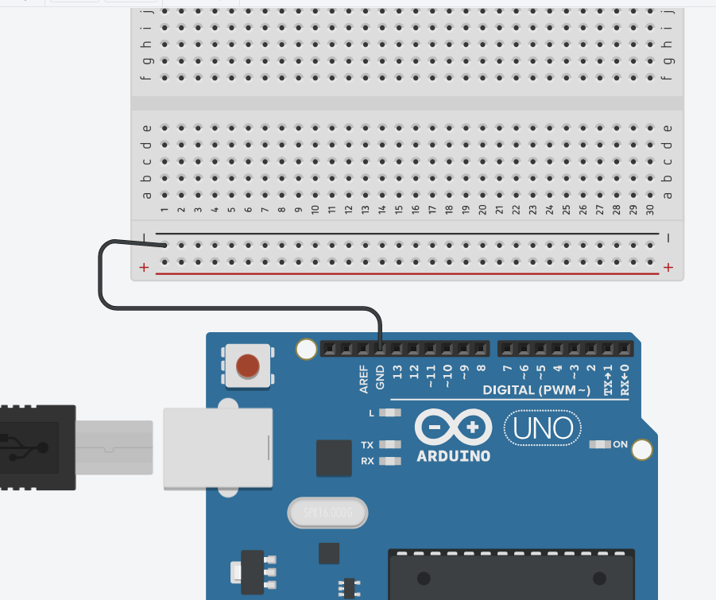
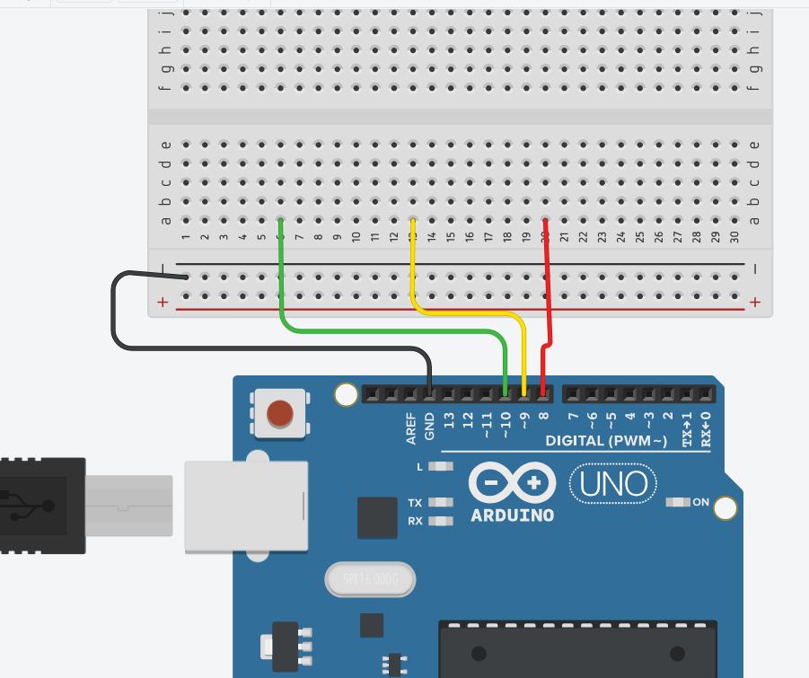
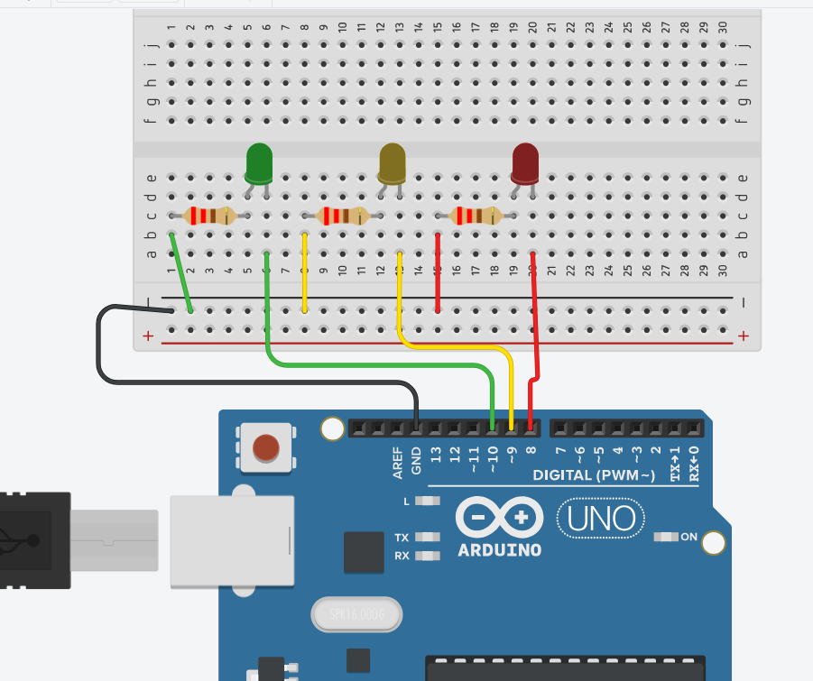

# Ponderada do Semáforo

Aqui será colocado os Links relacionados aos projetos que fiz tanto no **tinkercad** quando o **arduino físico em funcionamento**. O código relacionado ao projeto está no arquivo **código.ino**

**Link para o tinkercad:**(https://www.tinkercad.com/things/2bvYpcdWXll-semaforo-funcionando)

**Link para o Vídeo do arduino físico:**(https://youtube.com/shorts/5ingMj2-lZY?feature=share)


# Tutorial de Montagem

### Peças

Primeiro será apresentado as peças utilizadas para o projeto:

#### Materiais — Projeto Semáforo com Arduino

| Material            | Quantidade |
|----------------------|-------------|
| LED Verde            | 1           |
| LED Amarelo          | 1           |
| LED Vermelho         | 1           |
| Resistores           | 3           |
| Fios macho-macho     | 7           |
| Arduino Uno          | 1           |
| Protoboard           | 1           |
| Suporte com 3 Furos  | 1           |

Após separar os materiais, iremos para a montagem do projeto.

## Montagem 


<div align="center">
   

</div>

### Código

&emsp; Primeiro de tudo, devemos pegar o **Arduino** e programá-lo com o seguinte código dentro do **Arduino IDE**:
```
// ---- Classe LED ---- //
class Led {
  private:
    int pin;

  public:
    Led(int p) {
      pin = p;
      pinMode(pin, OUTPUT);
    }

    void on() {
      digitalWrite(pin, HIGH);
    }

    void off() {
      digitalWrite(pin, LOW);
    }
};

// ---- Classe Semaforo ---- //
class Semaforo {
  private:
    Led* verde;
    Led* amarelo;
    Led* vermelho;

    int estado; // 0 = verde, 1 = amarelo, 2 = vermelho
    unsigned long tempoAnterior;
    unsigned long duracao;

    void apagarTodos() {
      verde->off();
      amarelo->off();
      vermelho->off();
    }

  public:
    Semaforo(Led* v, Led* a, Led* r) {
      verde = v;
      amarelo = a;
      vermelho = r;
      estado = 0;
      tempoAnterior = 0;
      duracao = 0;
    }

    // Inicia no verde
    void iniciar() {
      apagarTodos();
      estado = 0;
      verde->on();
      tempoAnterior = millis();
      duracao = 6000UL; // 6 segundos (verde)
    }

    // Atualiza automaticamente de acordo com o tempo
    void atualizar() {
      unsigned long agora = millis();
      if (agora - tempoAnterior >= duracao) {
        proximo();
        tempoAnterior = agora;
      }
    }

  private:
    void proximo() {
      apagarTodos();

      if (estado == 0) {
        amarelo->on();
        estado = 1;
        duracao = 2000UL; // 2 segundos (amarelo)
      } 
      else if (estado == 1) {
        vermelho->on();
        estado = 2;
        duracao = 4000UL; // 4 segundos (vermelho)
      } 
      else {
        verde->on();
        estado = 0;
        duracao = 6000UL; // 6 segundos (verde)
      }
    }
};

// ---- Instanciando os objetos ---- //
Led verde(10);
Led amarelo(9);
Led vermelho(8);

Semaforo semaforo(&verde, &amarelo, &vermelho);

void setup() {
  Serial.begin(9600);
  semaforo.iniciar();
}

void loop() {
  semaforo.atualizar(); // troca automaticamente
}
```
&emsp; Resumindo o funcionamento desse código, definimos duas classes:
- **LED**: Terá as os códigos de ligar e desligar o led com **digitalWrite** e as definições dos pinos.
- **Semaforo**: terá as funções responsáveis por toda a lógica do tempo que cada led ficará ligada, as definições que todos os Leds estarão desligadas, definimos os valores "estados" e colocamos as variáveis que estarão no projeto.

&emsp; Além das definições de quais pinos do arduino serão usados e o void setup e loop.


### Construção

#### 1. Conexão do Terra (GND)

&emsp;Primeiramente, conecte o pino **GND** do Arduino ao **trilho negativo** (linha azul) da protoboard.  
Essa ligação tem o objetivo de criar um **ponto comum de retorno da corrente elétrica**, funcionando como o **"ralo"** por onde toda a energia que circula pelo circuito retorna.  
Sem essa conexão, o circuito elétrico não se fecha e os componentes não funcionam corretamente.

<div align="center">
   

</div>

#### 2. Conexão dos LEDs

&emsp;Em seguida, conecte três fios aos pinos digitais do Arduino, seguindo a ordem das cores do semáforo:

| Cor do LED | Pino Arduino | Coluna (Protoboard) | Linha |
|-------------|---------------|----------------------|--------|
| Verde       | 10            | 6                    | A      |
| Amarelo     | 9             | 13                   | A      |
| Vermelho    | 8             | 20                   | A      |

<div align="center">
   

</div>

&emsp;Agora, insira os **LEDs** na protoboard de modo que:
- A **perna positiva (ânodo)** de cada LED esteja conectada na **mesma coluna** do fio correspondente (verde, amarelo ou vermelho).
- A **perna negativa (cátodo)** esteja conectada **uma linha abaixo**, nas colunas **5, 12 e 19**, respectivamente.

<div align="center">
   

</div>

#### 3. Conexão dos Resistores

&emsp;Para proteger os LEDs contra sobrecorrente, conecte um **resistor** com cada LED:

- Uma ponta do resistor deve estar na **mesma coluna da perna negativa do LED** (colunas 5, 12 e 19).
- A outra ponta do resistor deve ser conectada **ao fio que está conectado ao trilho negativo (GND)** da protoboard.

<div align="center">
   

</div>

Dessa forma, cada LED possui seu próprio resistor limitador, garantindo o funcionamento seguro.

#### 4. Revisão Final

&emsp;Após todas as conexões:
- Verifique se o **GND** do Arduino está realmente ligado ao **trilho negativo**.  
- Confirme se os **fios dos pinos 8, 9 e 10** estão conectados corretamente aos LEDs **vermelho, amarelo e verde**, respectivamente.  
- Certifique-se de que **todos os resistores** estão conectados entre a **perna negativa dos LEDs** e o **trilho GND**.

&emsp;Com isso, o circuito estará **fechado e pronto para funcionamento**, permitindo que o programa do semáforo controle corretamente a sequência de cores.

## Avaliação em pares 

Thulio Bacco: Tudo 3, apenas a estrutura que poderia ser melhorada, deu 0,5 na parte de ir a mais.
Lucas Lopes: Tudo 3, apontou que não havia o ponteiro dentro do código, deu 0,5 nesta parte.


| Avaliador | Critério | Contempla (Pontos) | Contempla Parcialmente (Pontos) | Não Contempla (Pontos) | Observações do Avaliador |
|------------|-----------|--------------------|----------------------------------|------------------------|---------------------------|
| **Thulio Bacco** | Montagem física com cores corretas, boa disposição dos fios e uso adequado de resistores |  | 2,5 |  |  |
|  | Temporização adequada conforme tempos medidos com auxílio de algum instrumento externo | 3 |  |  |  |
|  | Código implementa corretamente as fases do semáforo e estrutura do código (variáveis representativas e comentários) | 3 |  |  | Estrutura poderia ser melhorada |
|  | Ir além: Implementou um componente extra, fez com `millis()` ao invés de `delay()` e/ou usou ponteiros no código |  | 0,5 |  |  |
|  | **Pontuação Total** | **9 / 10** |  |  |  |


| Avaliador | Critério | Contempla (Pontos) | Contempla Parcialmente (Pontos) | Não Contempla (Pontos) | Observações do Avaliador |
|------------|-----------|--------------------|----------------------------------|------------------------|---------------------------|
| **Lucas Lopes** | Montagem física com cores corretas, boa disposição dos fios e uso adequado de resistores | 3 |  |  |  |
|  | Temporização adequada conforme tempos medidos com auxílio de algum instrumento externo | 3 |  |  |  |
|  | Código implementa corretamente as fases do semáforo e estrutura do código (variáveis representativas e comentários) | 3 |  |  |  |
|  | Ir além: Implementou um componente extra, fez com `millis()` ao invés de `delay()` e/ou usou ponteiros no código |  | 0,5 |  | Não havia ponteiro no código |
|  | **Pontuação Total** | **9,5 / 10** |  |  |  |

